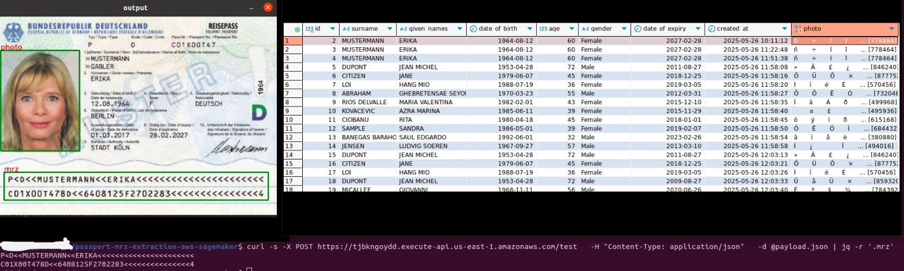

### Passport Data Extraction with AWS Sagemaker MultiModel Endpoint  ###


#### Output ####


#### Components ####
##### * AWS Sagemaker Multimodel endpoints with passport detection & text recognition models #####
##### * CI/CD , Deploying Sagemaker endpoint via Github Actions #####
##### * Accessing Sagemaker endpoint via REST API with AWS Lambda + Gateway API #####
##### * Writing passport data & photo to Database via SQL ##### 

#### Deployment Architecture  ####
!

#### Test Sagemaker endpoint  ####

```commandline
pip install -r requirements.txt
python scripts/main.py
```
```commandline
echo "{\"data\": \"$(base64 -w 0 test.jpg)\"}" > payload.json
curl -s -X POST https://tjbkngoydd.execute-api.us-east-1.amazonaws.com/test   -H "Content-Type: application/json"   -d @payload.json | jq -r '.mrz'
```

#### Deploying Sagemaker endpoint manually Github Actions  ####

```commandline
python scripts/sagemaker_deploy_and_test.py
```